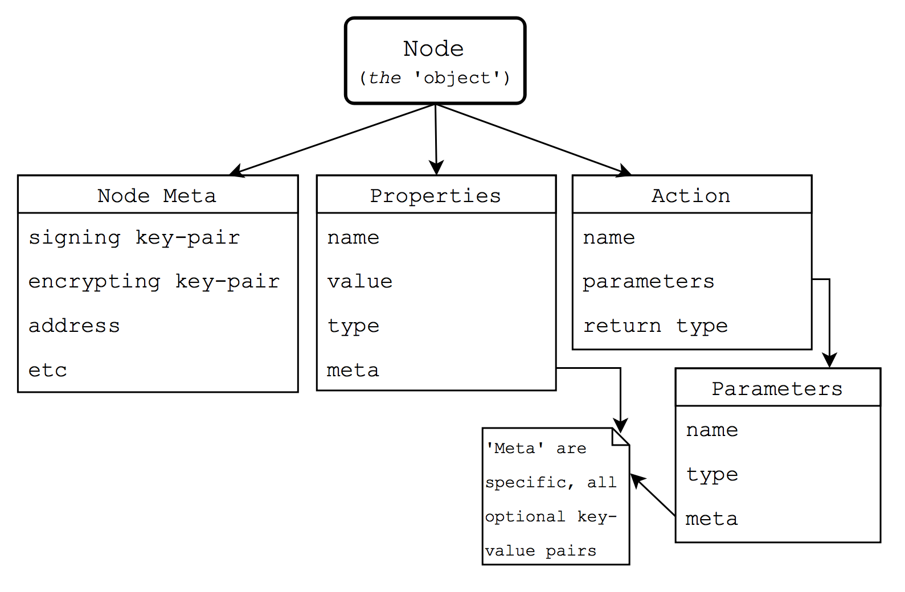
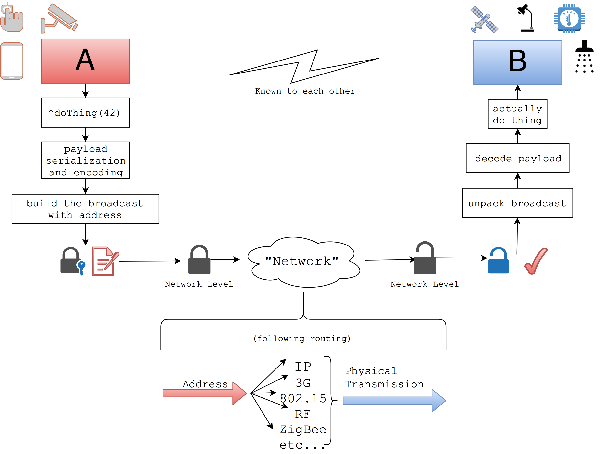
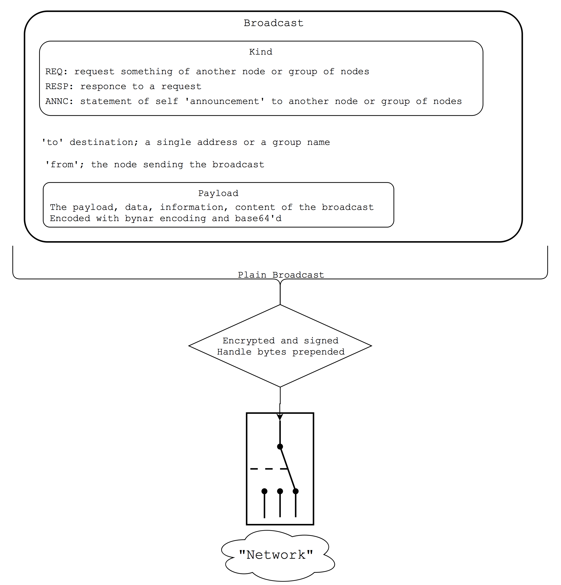

# Spinneret

"A decentralized intranet of wise things"

## About

*Elevator description:* Spinneret is a secure, peer-to-peer, semantic communication and remote call protocol. It defines "Nodes" with unique address and meaningful properties and procedures(actions). It also specifies a frame for secure communication between said nodes. It can operate on the application layer of IP, TCP, or other mesh-networking stacks (any RF, ZigBee, 802.15.4, Bluetooth).

See [Diagrams](#Diagrams) section below for diagrams and [`spec-draft02.md`](spec-draft02.md) for the full description and spec.

~

Spinneret is a project that I have been thinking about and working on and off for at least 3 years now (in its current form). I have not dedicated time to improving or implementing it for about seven months. As I progressed through Uni, other things started taking priority. This became a bloated project.

**I am nonetheless immensely proud of this project, learning a lot over the time working on it (despite things I would change[1] today). I would like to make it public and open source.** The code is extremely messy and all over the place, but the specification of the protocol is sound (although roughly written).

The initial and on going inspiration is the abundance of closed off, centralized 'IoT' ecosystems and protocols (from the WeMo, to industrial IoT, to the Amazon Echo today). I was trying to also avoid [XKCD 927](https://xkcd.com/927/) the best I could.

&mdash; Keely Hill, 6 Jan 2018

[1] On changes: While I stand by Spinneret's high level form, should I be continuing this project, I would change some microlevel things such the encryption algorithms specifics and the specific way in which the node data is structured as a byte string. I would also perhaps scrap my special encoding and replace with JSON or similar. Trying to slim the spec down and improve the writing clarity would also be a good undertaking. There are other simple, but broad changes such as changing to/from to dest/src.

# Full Description and  Specification
See [`spec-draft02.md`](spec-draft02.md), notably the 'Overview' section for a quick understanding.

## Directories (and 'Sub-projects')

- `Ideation/`: The first good draft of the spec, very detailed. Now after a few year, I would change a few things about it.

- `Prototype-Python-Implemenation/`: a fairly well along library that implements a `Node` (encoding/decoding broadcasts, receiving of broadcasts, and abstract creation of properties/actions) class that can then be subclassed by an actual device.

- `C Barebones attempt/`: An (incomplete) writing of a broadcast encoder/decoder in C. Got decently far.

- `Old Attempts:Tests/`: small early attempts/tests of working through this idea (i.e. possible ways to go about the protocol and implementation.

## Diagrams

Node

 

Broadcast Network Flow

 

Broadcast Structure

